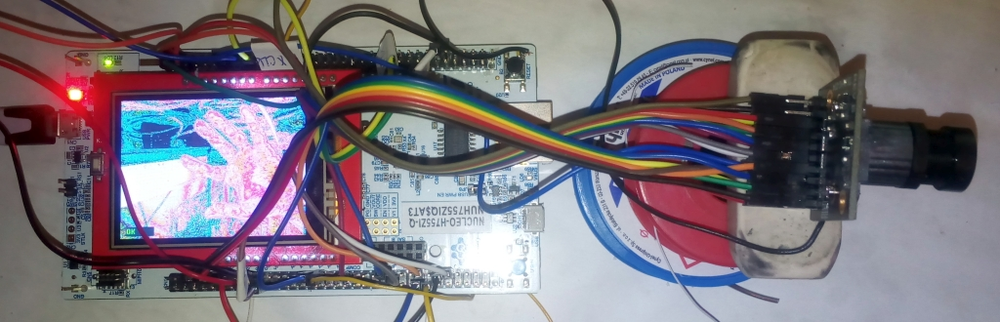
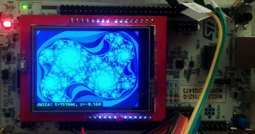
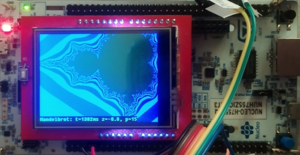

# Kamera na Nucleo-H755ZI
Prezentacja wykorzystania kamery OV5642 o rozdzieczości 5Mpix w kontrolerze STM32H755.
Poniewż płytka Nucleo nie oszałamia nadmiarem peryfieriów, więc do podglądu wykorzystałem wyświetlacz 320x240 ze złączem typu arduino. W projekcie jest sterownik tego wyświetlacza dla płytki NUCLEO-H755ZI. 
Mam też wersję dla wcześniej używanego NUCLEO F767ZI, która jest minimalnie inna, bo każda płytka ma inny zestaw portów podpiety do pinów złącza arduino.
Na obecnym etapie projektu obraz jest jest bardzo słabej jakości, ma przekłamane kolory i duży szum, ale coś już działa.
Obraz może być wyświetlony na ekranie albo przesyłany do aplikacji APL-NSK. Aplikaja może łaczyć się portem szeregowym, lub przez ethernet. 
Na obecnym etapie łączy się przez UART3 przez USB dostępny razem z interfejsem programującym, z aplikacji można zdalnie robić zdjęcie, przezsłać je i wywietlić. Funkcjonalność łącza ethernetowego jest dopiero rozwijana.

# Dodatki
Aby móc ocenić wydajność kontrolera obciążam go algrytmem i obserwują jak się zachowuje w porównaniu z innymi. Świetne do tego są fraktale. Poniżej przykłady generowania fraktala Julii i Mandelbrota

