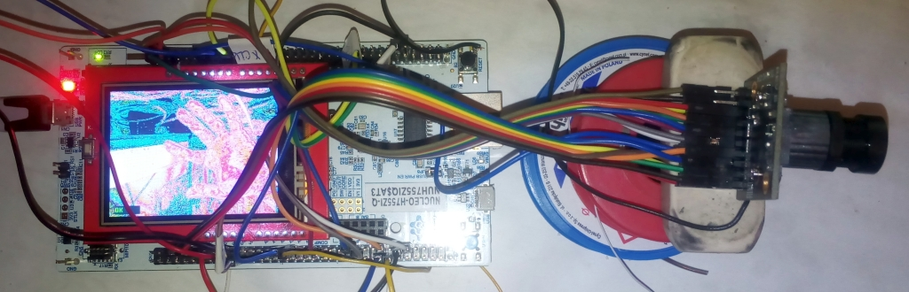
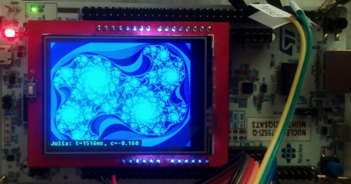
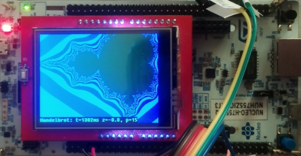
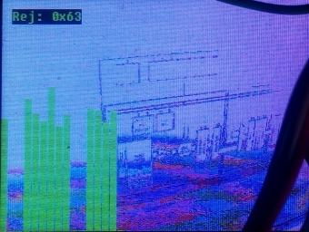
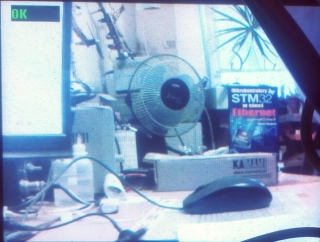

# Kamera na Nucleo-H755ZI
Prezentacja wykorzystania kamery OV5642 o rozdzieczości 5Mpix w kontrolerze STM32H755.
Poniewż płytka Nucleo nie oszałamia nadmiarem peryfieriów, więc do podglądu wykorzystałem wyświetlacz 320x240 ze złączem typu arduino. W projekcie jest sterownik tego wyświetlacza dla płytki NUCLEO-H755ZI. 
Na obecnym etapie projektu obraz jest jest bardzo słabej jakości, ma przekłamane kolory i duży szum, ale coś już działa.
Obraz może być wyświetlony na ekranie albo przesyłany do aplikacji APL-NSK. Aplikaja może łaczyć się portem szeregowym, lub przez ethernet. 
Na obecnym etapie łączy się przez UART3 przez USB dostępny razem z interfejsem programującym, z aplikacji można zdalnie robić zdjęcie, przezsłać je i wywietlić. Funkcjonalność łącza ethernetowego jest dopiero rozwijana.

## Dodatki
### Fraktale
Aby móc ocenić wydajność kontrolera obciążam go algrytmem i obserwują jak się zachowuje w porównaniu z innymi. Świetne do tego są fraktale. Poniżej przykłady generowania fraktala Julii i Mandelbrota. 
Julia łatwo się liczy, ale dla przyjetej w projekcie animacji, czas obliczeń każdej klatki animacji jest inny, przez co ciężko jest ją porówywać. Czas obliczeń Mandelbrota dla stałego powiekszenia jest stały.
Dla przykładu na STM32H755 fraktal Mandelbrota o rozdzielczości 320x240 liczony jest przez 139ms.

### Histogram
Świetne narzędzie do analizy obrazu i debugowania problemów. Dalczego obraz ma przekłamane kolory? 

Bo nie ma w nim 4 z 16 bitów: trzeba było zalutować zworki SB9 i SB20 na płytce Nucleo. 
Jeżeli jeszcze zmieniłem zbocze na którym próbkowane są dane to obraz stał się najzupełniej poprawny:

